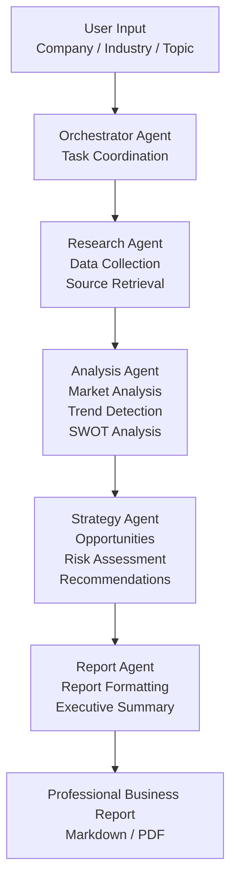

# System Architecture

## Overview

InsightFlow is an AI-powered business intelligence system that transforms a company name or business topic into a structured business report using a multi-agent architecture.

## Workflow

## Agent Responsibilities

### Orchestrator Agent
Coordinates workflow execution and manages communication between agents.

### Research Agent
Collects company, market, and industry information from available sources.

### Analysis Agent
Processes research data and extracts trends, insights, and business intelligence.

### Strategy Agent
Generates recommendations, identifies opportunities, and evaluates risks.

### Report Agent
Formats all findings into a professional business report.
